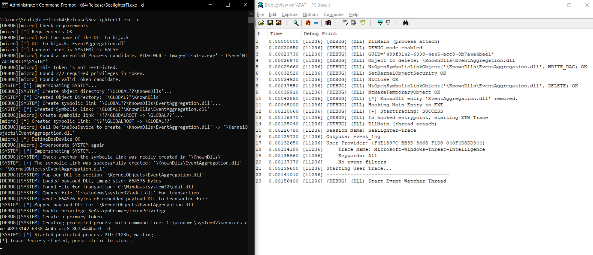
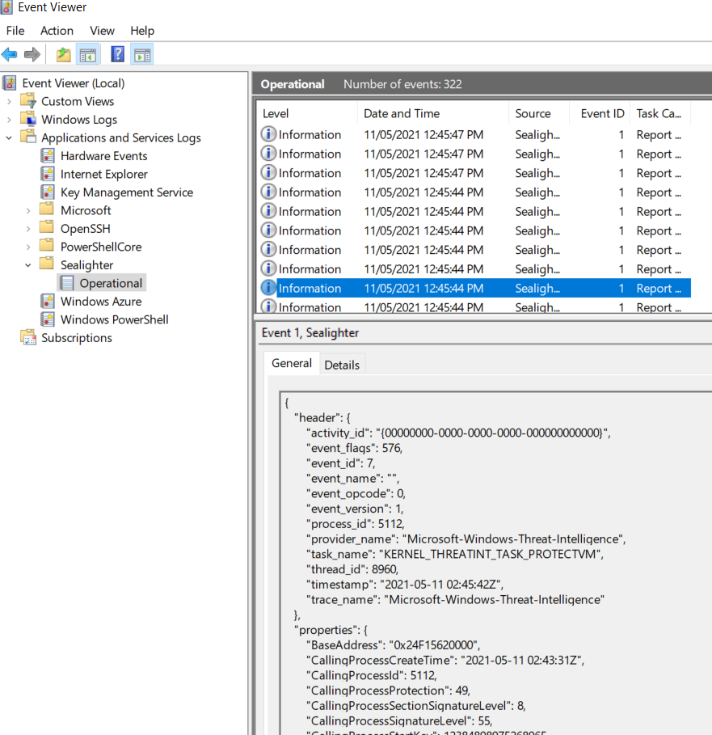

# Sealighter-TI
Combining Sealighter with unpatched exploits and [PPLDump](https://github.com/itm4n/PPLdump) to run the `Microsoft-Windows-Threat-Intelligence` ETW Provider without a signed driver.

# Overview
## The Problem - PPL and Anti-Malware
The `Microsoft-Windows-Threat-Intelligence` ETW Provider is an excelent tool to [detect process injection](https://blog.redbluepurple.io/windows-security-research/kernel-tracing-injection-detection), and other type of attacks. Unlike usermode hooking or in-process ETW Providers, avoiding or tampering with the `Threat-Intelligence` is very difficult.

However, to subscribe to this Provider requries a process with very special privliges, marked as [Protected Process Light (PPL)](https://www.alex-ionescu.com/?p=97) 'Anti-Malware' or higher. To legitimatly run a program at this level you must submit a driver to Microsoft to be co-signed by them, something not everyone has the inclination or reputation to do.

I originally created a research project named [PPLRunner](https://github.com/pathtofile/PPLRunner) that would allow you create PPL process in a test environment, however it requires Windows to be put into a debug or 'test signing' mode. This could in theory also have the affect of altering the behaviour of the malware or program you are attempting to analyse, which may behave differently if it believes it is not on a 'real' machine.


## The Solution - Exploit to success
Back in 2018 [Alex Ionescu](https://twitter.com/aionescu) and [James Forshaw](https://twitter.com/tiraniddo) presented a [series of talks](http://publications.alex-ionescu.com/Recon/Recon%202018%20-%20Unknown%20Known%20DLLs%20and%20other%20code%20integrity%20trust%20violations.pdf), as well as some [blogs](https://googleprojectzero.blogspot.com/2018/08/windows-exploitation-tricks-exploiting.html), covering many ways you could trick Windows into illegitimately running arbitry code at the PPL level. A number of these techniques remain unpatched to this day.

In 2021 [Clément Labro](https://twitter.com/itm4n) created the project [PPLDump](https://github.com/itm4n/PPLdump), which uses one of the unpatched techniques Alex and James covered, to trick a PPL-elevated `services.exe` into loading an arbitraty DLL.


## The Glue - SealighterTI
PPLDump uses it's elevated access to dump the memory of `lsass.exe`. I've taken Clément's awesome code, and instead combined it with my ETW Logging tool [Sealighter](https://github.com/pathtofile/Sealighter), to enable you to get events from the `Microsoft-Windows-Threat-Intelligence` logging to the Windows Event Log. This is possible from a 'production' machine, without the need for a signed driver or to put the machine into 'test signing' mode.


# To Build
To use pre-built binaries, download the `SealighterTI.exe` and `sealigher_provider.man` from [The Releases Page](https://github.com/pathtofile/SealighterTI/releases).

To build manually, first check out the source code (make sure to use `--recursive`):
```bash
git clone --recursive https://github.com/pathtofile/SealighterTI.git
```

# To Run
First Open up the `sealigher_provider.man` in a text editor, and replace all uses of `!!SEALIGHTER_LOCATION!!` with the full path to the `SealighterTI.exe` binary. Then from an elevated command prompt run:
```bash
wevtutil im path/to/sealigher_provider.man
```

The just run `SealighterTI.exe`. For the first run, I reccomend running withe the debug flag:
```bash
SealighterTI.exe -d

```
For the first run I also reccoment having a copy of [Sysinternal's DBGView](https://docs.microsoft.com/en-us/sysinternals/downloads/debugview) open with the "Capture Global Win32" option set, so you can see the debug logs from the DLL/PPL Process as well. If run correctly It should look like this:


Once it gets to "press ctrl+c to stop" Open Event Viewer, and you should see events under 'Application and Service Logs/Sealighter/Operational':


To stop the trace, pres 'ctrl+c' in the `SealighterTI.exe` window.

# Technical Details
See [this blog](https://blog.tofile.dev) for the technical details about how everything works.

# Compatability
This has only been tested on Windows 10 x64.

# Aknowlegements
All of the work to run arbitary code as PPL is the work of [Clément Labro](https://twitter.com/itm4n) and their [PPLDump](https://github.com/itm4n/PPLdump) project. I simply worked on glueing the ETW Logging to the end of it.

The Research from [Alex Ionescu](https://twitter.com/aionescu) and [James Forshaw](https://twitter.com/tiraniddo) is instrumental the making this project possible.

[Filip Olszak](https://twitter.com/_lpvoid) has written a [great blog](https://blog.redbluepurple.io/windows-security-research/kernel-tracing-injection-detection) about the usefulness of the `Threat-Intelligence` ETW Provider.


# Further Reading/Links
- http://publications.alex-ionescu.com/Recon/Recon%202018%20-%20Unknown%20Known%20DLLs%20and%20other%20code%20integrity%20trust%20violations.pdf
- https://blog.scrt.ch/2021/04/22/bypassing-lsa-protection-in-userland/
- https://googleprojectzero.blogspot.com/2018/08/windows-exploitation-tricks-exploiting.html
- https://www.alex-ionescu.com/?p=97
- https://blog.redbluepurple.io/windows-security-research/kernel-tracing-injection-detection
- https://github.com/itm4n/PPLdump
- https://github.com/pathtofile/PPLRunner
- https://github.com/pathtofile/Sealighter
